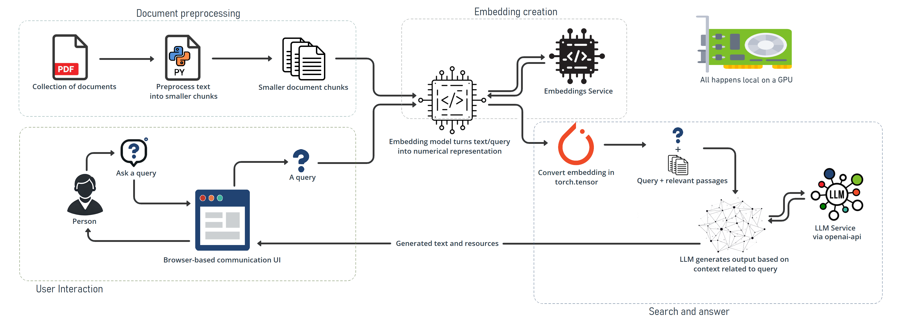

# RAG-CHATBOT-APP

A Retrieval-Augmented Generation (RAG) chatbot application built with Flask, leveraging LM-Studio's REST API for embeddings and model operations.  
The user interface is implemented in HTML/CSS, with assets in the `templates/` and `static/` directories. Easily deployable via Docker (here is my docker configuration: [Dockerhub](https://hub.docker.com/repository/docker/michafein/ragchatapp/general)).

---

## Table of Contents

- [Features](#features)
- [Flowchart](#flowchart)
- [Prerequisites](#prerequisites)
- [Installation](#installation)
- [Usage](#usage)
- [Folder Structure](#folder-structure)
- [Links](#links)

---

## Features

- **Flask REST API**: Backend for processing user requests.
- **HTML/CSS Frontend**: Clean and responsive interface.
- **LM-Studio Integration**: REST API for embeddings and model inference.
- **Docker Support**: Containerized deployment.
- **Testing**: Unit tests in the `tests/` directory.

---

## Flowchart


---

## Prerequisites

- **Python 3.9+** [Install Python] (https://www.python.org/downloads/)
- **LM-Studio:**[LM-Studio](https://lmstudio.ai/) Ensure LM-Studio is running as a REST API.
- **Git:** For version control.
- **Docker:** (Optional) For containerized deployment.

---

## Installation

### 1. Clone the Repository

```
git clone https://github.com/michafein/ragchatapp.git
cd chatbot-RAGapp
```
### 2. Set Up Virtual Environment

**Create a virtual environment (recommended):**
```
python -m venv venv
```

### Activate the virtual environment:
***On Linux/macOS:***
```
source venv/bin/activate
```
***On Windows:***
```
venv/bin/activate
```
### 3. Install Dependencies
```
pip install -r requirements.txt
```

### 4. Set Up LM-Studio

1. **Install LM-Studio**:
   - Download and install LM-Studio from [LM-Studio](https://lmstudio.ai/).

2. **Load Models in LM-Studio**:
   - Open LM-Studio and load your models:
     - **my Chat Model**: 
     [`deepseek-r1-distill-qwen-7b`](https://huggingface.co/deepseek-ai/DeepSeek-R1-Distill-Qwen-7B)
     - **my Sentence Transformer Embedding-Model**: 
     [`text-embedding-all-minilm-l6-v2-embedding`](https://huggingface.co/sentence-transformers/all-MiniLM-L6-v2)

3. **Enable REST API in LM-Studio**:
   - Go to **Developer Settings** in LM-Studio.
   - Enable the **REST API** and note the API URL (default: `http://localhost:1234`).

4. **Update `config.py`**:
   - Open the `config.py` file and ensure the following settings match your LM-Studio configuration:
     ```python
     LM_STUDIO_API_URL = "http://localhost:1234/v1/chat/completions"
     LM_STUDIO_EMBEDDING_API_URL = "http://localhost:1234/v1/embeddings"
     # Name must match LM-Studio's model
     EMBEDDING_MODEL_NAME = "text-embedding-all-minilm-l6-v2-embedding"
     CHAT_MODEL_NAME = "deepseek-r1-distill-qwen-7b"
     ```
 

---

## Usage

### Running RAG-ChatBot Application Locally

1. **Start the Flask Server**:
   - Run the following command in your terminal:
     ```
     "python app.py"
     ```

2. **Access the Application**:
   - Open your browser and navigate to [http://127.0.0.1:5000](http://127.0.0.1:5000) to interact with the chatbot.

---
## Folder Structure

```
"chatbot-RAGapp/"
├── Logo/                      # Directory for logos and images
├── static/                    # Static assets (CSS, JS, images)
│   ├── chatbot.png            # Chatbot logo
│   ├── favicon.ico            # Favicon for the website
│   ├── style.css              # Main stylesheet
├── templates/                 # Frontend HTML template file
│   ├── chat.html              # Main chat interface
├── tests/                     # Unit tests
│   ├── test_app.py            # Tests for the Flask app
│   ├── test_utils.py          # Tests for utility functions
├── app.py                     # Flask application entry point
├── config.py                  # Configuration settings
├── Dockerfile                 # Docker configuration
├── embeddings.pt              # Embeddings file for model
├── human-nutrition-text.pdf   # Sample document for processing
├── pages_and_chunks.json      # JSON file with preprocessed text chunks
├── README.md                  # Project documentation
├── requirements.txt           # Python dependencies
├── utils.py                   # Utility functions
```

# Links

The RAG-Chatbot is constructed using the deepseek-r1-distill-qwen-7b:

```
https://huggingface.co/deepseek-ai/DeepSeek-R1-Distill-Qwen-7B
```

The Sentence Transformer Embedding-Model is constructed using the text-embedding-all-minilm-l6-v2-embedding:
```
https://huggingface.co/sentence-transformers/all-MiniLM-L6-v2
```
